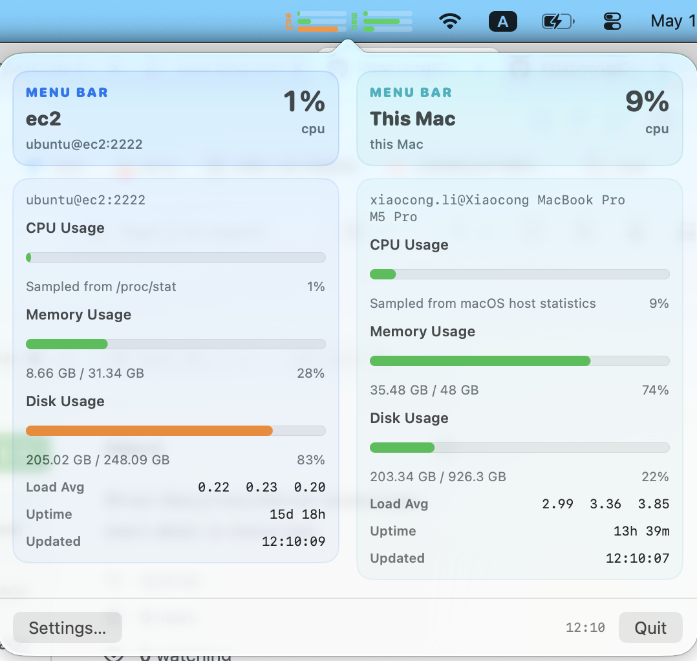

# ComputerBar

ComputerBar is a macOS menu bar monitor for local and remote machines. It shows compact CPU, memory, and disk bars directly in the menu bar, then opens a larger popover with detailed host status.



## Features

- Monitor this Mac and remote Linux hosts over SSH.
- Display multiple selected machines in the menu bar.
- Stack CPU, memory, and disk usage bars per machine to keep the menu bar compact.
- Use the popover for detailed CPU, memory, disk, load average, uptime, and last-updated status.
- Publish widget snapshots for the desktop widget.
- Refresh in the background on the configured interval.

## Requirements

- macOS 14 or newer.
- Xcode command line tools.
- `xcodegen` for building the app bundle with the widget extension.
- SSH access configured in `~/.ssh/config` for remote hosts.

Install `xcodegen` with:

```bash
brew install xcodegen
```

## Build And Test

Run tests:

```bash
swift test
```

Build, install, and launch the app:

```bash
./scripts/install-app.sh
```

The script builds `ComputerBar.app`, installs it to `/Applications/ComputerBar.app`, registers the widget extension, and launches the app.

## Usage

Open the menu bar item to view monitored machines. Use `Settings...` to select which machines appear in the menu bar and adjust the refresh interval.

Remote machines are discovered from SSH config aliases. Each selected machine contributes one compact menu bar element with three stacked bars:

- `cpu`
- `mem`
- `dsk`

## Repository Layout

- `Sources/ComputerBar/` - macOS app, menu bar controller, settings, SSH monitoring, and UI.
- `Sources/ComputerBarShared/` - shared widget snapshot models and persistence.
- `Sources/ComputerBarWidget/` - WidgetKit extension.
- `Tests/ComputerBarTests/` - app model, SSH parsing, monitor parsing, and widget snapshot tests.
- `Resources/` - app icons, entitlements, plists, and screenshots.
- `scripts/install-app.sh` - build, sign, install, register, and launch workflow.
